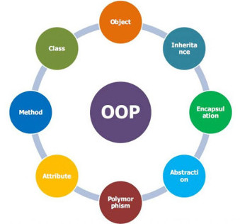

# OOP PHP 🙌

## Aim 🏹

- Classes and Objects
- Properties and visibility
- Namespaces
- Autoloading classes
- Inheritance
- Exception handling

### Continuation of maziwa

- User and Database class
- Properties
- Director and Employee class

#### @Credits
- [Image](https://www.quickstart.com/)

> "The problem with self-esteem – whether it is high or low – is that, every single day, we are in the courtroom" _Tim Keller_